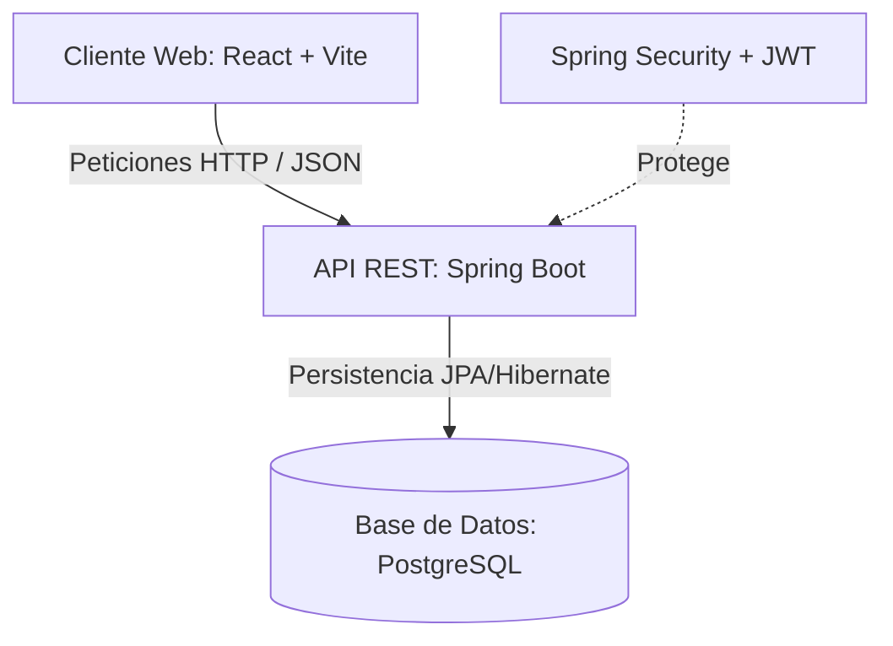

# 🩺 MediFind — Plataforma Médica Integral

MediFind es una plataforma digital diseñada para conectar pacientes con profesionales de la salud y clínicas. Permite la búsqueda inteligente de médicos por especialidad, la reserva y gestión de citas en tiempo real, administración de agendas médicas, y cuenta con un módulo integrado de farmacia en línea (productos y pedidos).

El sistema está construido con una arquitectura moderna de **Frontend desacoplado** (React + TypeScript) y **Backend de microservicios/monolito modular** (Spring Boot + PostgreSQL).

---

## 🚀 Arquitectura del Sistema

El proyecto está dividido en dos directorios principales:

*   **`MediFind_SpringV/`**: API REST en Spring Boot que gestiona las reglas de negocio, persistencia de datos y seguridad.
*   **`mediFRONT/`**: Aplicación de cliente web interactiva y responsiva desarrollada en React y TypeScript.



---

## 🛠️ Tecnologías y Herramientas

### Backend (`MediFind_SpringV`)
*   **Lenguaje:** Java 17
*   **Framework:** Spring Boot 4.1.0 (Spring MVC, Spring Data JPA, Spring Security)
*   **Gestor de Dependencias:** Gradle
*   **Seguridad:** Autenticación y Autorización basada en tokens JWT (JSON Web Tokens)
*   **Base de Datos:** PostgreSQL
*   **Documentación:** Springdoc OpenAPI / Swagger UI

### Frontend (`mediFRONT`)
*   **Framework/Entorno:** React 18+ (con Vite y TypeScript)
*   **Estilos:** Tailwind CSS (diseño responsivo y personalizado)
*   **Iconografía:** Lucide React
*   **Enrutamiento:** React Router DOM (con protección de rutas según rol del usuario)
*   **Estado:** React Context API (para estado global de autenticación)

---

## 📂 Estructura de Directorios

```text
mediApp/
├── MediFind_SpringV/                 # Proyecto del Backend (Spring Boot + Gradle)
│   ├── src/main/java/com/example/medifind_springv/
│   │   ├── config/                   # Configuraciones de seguridad, CORS, filtros JWT
│   │   └── modules/                  # Módulos del negocio
│   │       ├── appointments/         # Gestión de Citas (Cita)
│   │       ├── auth/                 # Registro y Login de Usuarios
│   │       ├── catalog/              # Catálogos de especialidades, categorías, etc.
│   │       ├── patient/              # Información del Paciente
│   │       ├── profile/              # Perfiles de Médicos y Clínicas
│   │       └── settings/             # Ajustes y Configuraciones
│   ├── src/main/resources/
│   │   ├── application.properties    # Configuración de variables del sistema
│   │   └── init.sql                  # Script de creación de base de datos y esquema
│   ├── Dockerfile                    # Dockerfile multi-etapa para el Backend
│   └── docker-compose.yml            # Docker Compose para base de datos PostgreSQL
│
└── mediFRONT/                        # Proyecto del Frontend (React + TS + Vite)
    ├── src/
    │   ├── auth/                     # Contexto de autenticación y lógica de protección de rutas
    │   ├── components/               # Componentes comunes de UI (Navbar, formularios)
    │   ├── pages/                    # Vistas principales (HomePage, SearchPage, LoginPage)
    │   │   └── professional/         # Páginas dedicadas al perfil médico (Agenda, Ajustes)
    │   ├── services/                 # Servicios de conexión al API (Axios/Fetch)
    │   └── types/                    # Tipados y modelos de datos en TypeScript
    ├── dockerfile                    # Dockerfile de producción (Build en Nginx)
    └── docker-compose.yml            # Docker Compose para levantar el Frontend localmente
```

---

## ⚙️ Requisitos Previos

Antes de ejecutar el proyecto, asegúrate de tener instalado:

1.  **Java Development Kit (JDK) 17**
2.  **Node.js 22.x** y **npm**
3.  **Docker** y **Docker Compose**

---

## 🏃 Guía de Configuración y Ejecución

### 1. Base de Datos (PostgreSQL en Docker)

El backend de MediFind requiere una base de datos PostgreSQL activa. La forma más sencilla de levantarla es usando Docker Compose dentro del directorio del backend.

1. Navega a la carpeta del backend:
   ```bash
   cd MediFind_SpringV
   ```
2. Levanta el contenedor de la base de datos (y opcionalmente el backend):
   ```bash
   docker compose up -d db
   ```
   > [!NOTE]
   > El contenedor cargará automáticamente el archivo [init.sql](file:///home/baxava/Documents/UAM%202026/emprendedores/MEDIFIND/mediApp/MediFind_SpringV/init.sql) para crear las tablas, relaciones, enums e índices del sistema.

### 2. Ejecutar el Backend (Spring Boot)

1. Verifica que las credenciales de base de datos en [application.properties](file:///home/baxava/Documents/UAM%202026/emprendedores/MEDIFIND/mediApp/MediFind_SpringV/src/main/resources/application.properties) coincidan con las de tu entorno o contenedor Docker. Las credenciales por defecto son:
   *   **URL:** `jdbc:postgresql://localhost:5432/medifind_db`
   *   **Usuario:** `baxava`
   *   **Contraseña:** `medifind_baxava`
2. Desde la carpeta `MediFind_SpringV/`, ejecuta el backend mediante Gradle:
   ```bash
   ./gradlew bootRun
   ```
3. El servidor iniciará en el puerto `8080`. Puedes verificar que está activo visitando la documentación Swagger en tu navegador:
   🔗 [http://localhost:8080/swagger-ui/index.html](http://localhost:8080/swagger-ui/index.html)

### 3. Ejecutar el Frontend (React + Vite)

1. Navega a la carpeta del frontend:
   ```bash
   cd ../mediFRONT
   ```
2. Instala las dependencias de Node:
   ```bash
   npm install
   ```
3. Crea o edita el archivo `.env` en la raíz de `mediFRONT` para configurar la URL del API Backend:
   ```env
   VITE_API_BASE_URL=http://localhost:8080
   ```
4. Inicia el servidor de desarrollo:
   ```bash
   npm run dev
   ```
5. Abre en tu navegador la dirección indicada en la terminal (por defecto `http://localhost:5173`).

---

## 🗄️ Detalle del Esquema de Datos (PostgreSQL)

La base de datos cuenta con una estructura relacional altamente organizada. A continuación se resumen las tablas principales contenidas en [init.sql](file:///home/baxava/Documents/UAM%202026/emprendedores/MEDIFIND/mediApp/MediFind_SpringV/init.sql):

| Tabla | Propósito | Relaciones Clave |
| :--- | :--- | :--- |
| **`usuario`** | Cuentas de acceso con credenciales, estado (activo, suspendido) y rol (paciente, doctor, clinica, admin). | — |
| **`paciente`** | Datos personales de los pacientes. | `usuario_id` (1:1) |
| **`doctor`** | Perfil profesional de los doctores, especialidad principal y detalles de contacto. | `usuario_id` (1:1) |
| **`clinica`** | Información de clínicas, dirección, teléfono y horarios. | `usuario_id` (1:1) |
| **`doctor_clinica`** | Tabla puente que conecta doctores con las clínicas en las que atienden. | `doctor_id`, `clinica_id` |
| **`lugar_atencion`** | Registra dónde atiende un profesional (físico, domicilio, online). | `doctor_id`, `clinica_id` |
| **`horario_atencion`**| Horarios específicos en los que atiende el doctor en un lugar. | `lugar_atencion_id` |
| **`cita`** | Registra las citas reservadas por pacientes, estado (`pendiente`, `confirmada`, `cancelada`), fecha y costo. | `paciente_id`, `doctor_id`, `lugar_atencion_id` |
| **`review`** | Reseñas y calificaciones (1 a 5 estrellas) dejadas por los pacientes. | `cita_id`, `doctor_id`, `clinica_id` |
| **`producto`** | Medicamentos y productos de la farmacia virtual integrada. | `categoria_id` |
| **`pedido`** y **`detalle_pedido`** | Órdenes de compra y carrito de productos de la farmacia. | `paciente_id`, `pedido_id`, `producto_id` |

---

## ⚙️ Compilación e Integración Avanzada

### Compilación Unificada (Opcional)
El proyecto de backend cuenta con tareas Gradle para instalar dependencias, compilar el frontend y copiar el resultado (`dist/`) dentro de los recursos estáticos del backend (`src/main/resources/static`). De esta forma, Spring Boot puede servir tanto la API como el sitio web desde un solo puerto.

> [!WARNING]
> En [build.gradle](file:///home/baxava/Documents/UAM%202026/emprendedores/MEDIFIND/mediApp/MediFind_SpringV/build.gradle), la variable `frontendDir` está configurada como:
> ```groovy
> def frontendDir = "$projectDir/../../mediFRONT/mediFRONT"
> ```
> Si estás utilizando la estructura estándar del repositorio local actual, es posible que necesites corregir esta ruta a:
> ```groovy
> def frontendDir = "$projectDir/../mediFRONT"
> ```
> Para compilar y empaquetar de forma integrada después de ajustar la ruta:
> ```bash
> ./gradlew build
> ```

---

## 👥 Roles de Usuario Soportados
1.  **Paciente (`paciente`)**: Busca especialistas, reserva citas, califica la atención recibida y compra productos médicos.
2.  **Médico (`doctor`)**: Gestiona su agenda y horarios de atención, configura sus lugares de consulta y revisa su historial de citas.
3.  **Clínica (`clinica`)**: Administra sus sucursales, especialidades ofrecidas, galería de imágenes y personal médico asociado.
4.  **Administrador (`admin`)**: Supervisión general del sistema, aprobación de perfiles de salud y gestión de catálogos.
